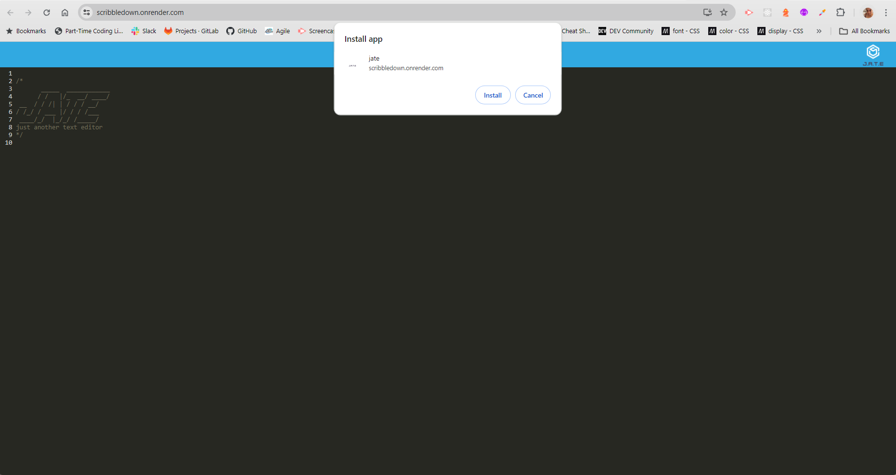
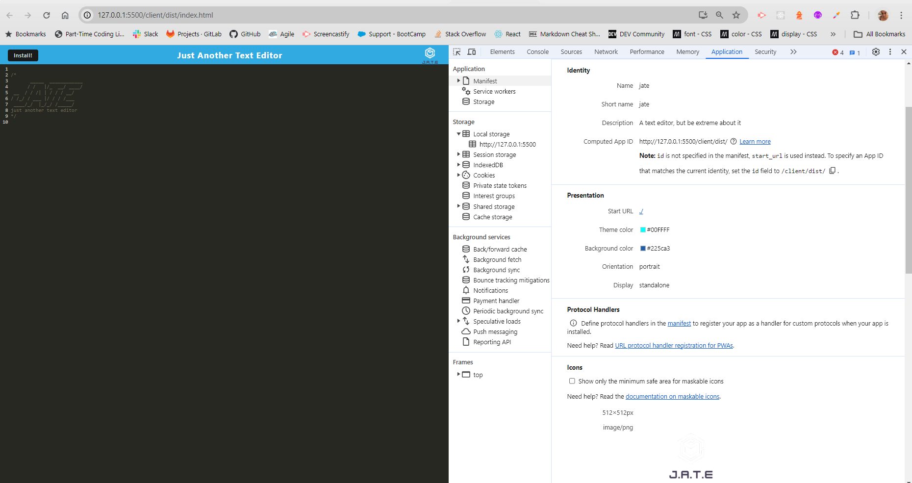

# 19 - Challenge: Progressive Web Applications (PWA) Challenge: Text Editor

My task is to build a text editor that runs in the browser. The app will be a single-page application that meets the PWA criteria. Additionally, it will feature a number of data persistence techniques that serve as redundancy in case one of the options is not supported by the browser. The application will also function offline.

To build this text editor, I started with an existing application and implement methods for getting and storing data to an IndexedDB database. You used a package called idb, which is a lightweight wrapper around the IndexedDB API. It features a number of methods that are useful for storing and retrieving data, and is used by companies like Google and Mozilla.

You deployed this full-stack application to Render using the Render Deployment Guide.

## User Story
```

AS A developer
I WANT to create notes or code snippets with or without an internet connection
SO THAT I can reliably retrieve them for later use

```

## Acceptance Criteria
```
GIVEN a text editor web application
WHEN I open my application in my editor
THEN I should see a client server folder structure
WHEN I run `npm run start` from the root directory
THEN I find that my application should start up the backend and serve the client
WHEN I run the text editor application from my terminal
THEN I find that my JavaScript files have been bundled using webpack
WHEN I run my webpack plugins
THEN I find that I have a generated HTML file, service worker, and a manifest file
WHEN I use next-gen JavaScript in my application
THEN I find that the text editor still functions in the browser without errors
WHEN I open the text editor
THEN I find that IndexedDB has immediately created a database storage
WHEN I enter content and subsequently click off of the DOM window
THEN I find that the content in the text editor has been saved with IndexedDB
WHEN I reopen the text editor after closing it
THEN I find that the content in the text editor has been retrieved from our IndexedDB
WHEN I click on the Install button
THEN I download my web application as an icon on my desktop
WHEN I load my web application
THEN I should have a registered service worker using workbox
WHEN I register a service worker
THEN I should have my static assets pre cached upon loading along with subsequent pages and static assets
WHEN I deploy to Render
THEN I should have proper build scripts for a webpack application
```

## Screen Shots / Mock-Up:







## Table of Contents


- [Installation](#installation)
- [Usage](#usage)
- [Acknowedgements](#acknowledgements)
- [Links to Deployed site and GitHub](#links)
- [Resources](#resources)
- [License](#license)

## Installation

In order to run the application you can open the url link provided.  Once there you can click the install button to install the app to your desktop.  This will allow you to use the app offline and anywhere you go.  

https://scribbledown.onrender.com/

## Usage

Once you have the webpage open or installed the the application, you can use the app as a basic text editor which will save your notes regardless if you are online or not.
This makes sure that you have access to your notes even if there is a service interruption or you are somewhere with no connection.

## Acknowledgements

Adreas (amotsie) at AskSCS Learning Assistant: for helping me debbug: ask-310030

## Links: 

Deployed Site:  https://scribbledown.onrender.com/

GitHub Link: https://github.com/Marisol514/ScribbleDown


## Resources

- [Google Developers PWA Checklist](https://developers.google.com/web/progressive-web-apps/checklist)

- [IndexedDB API Documentation](https://developer.mozilla.org/en-US/docs/Web/API/IndexedDB_API)

- [idb Package Documentation](https://github.com/jakearchibald/idb)

- [Render Deployment Guide](https://render.com/docs/deploy-create-react-app)

- [Webpack Documentation](https://webpack.js.org/concepts/)

- [Service Worker Documentation](https://developer.mozilla.org/en-US/docs/Web/API/Service_Worker_API)

- [Workbox Documentation](https://developers.google.com/web/tools/workbox)

## License

MIT License

## Features

The feature of this app is being able to be downloaded to your device, runs offline, and saves the entries you made.
